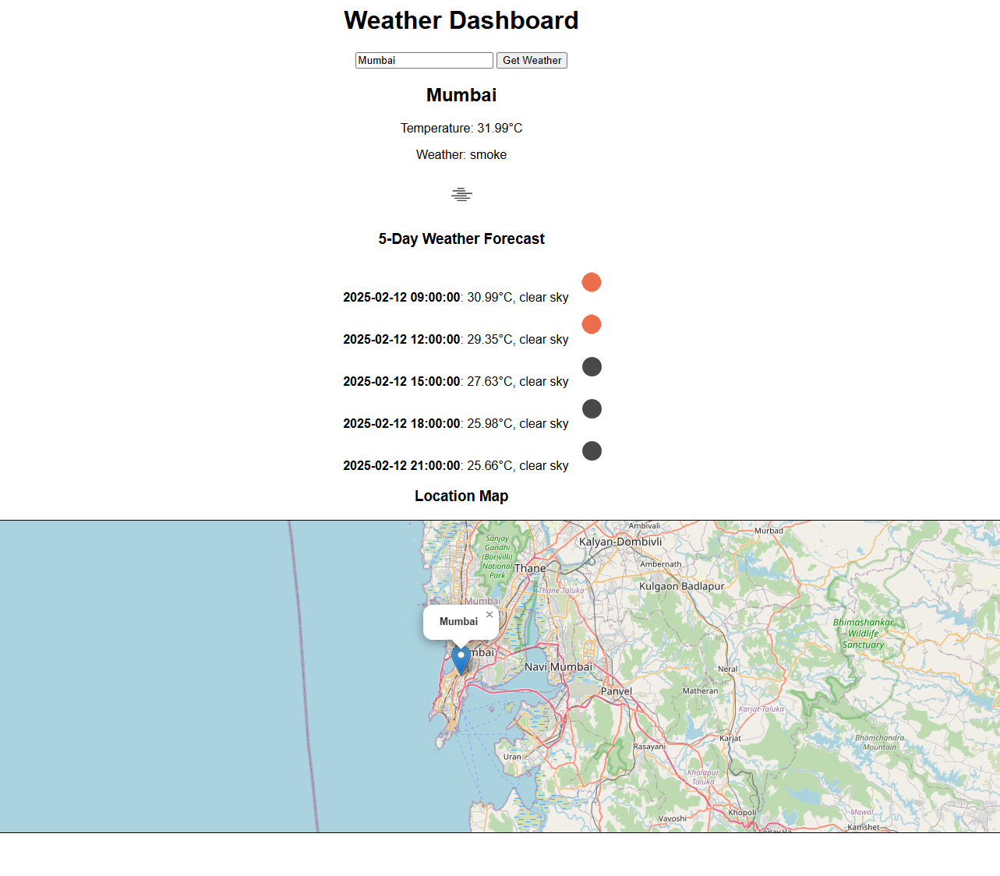

# Weather Dashboard

## 🌟 Project Overview
The **Weather Dashboard** is a Flask-based web application that provides real-time weather updates and a 5-day forecast using the **OpenWeather API**. It also allows users to save favorite locations, view weather alerts, and visualize locations on an interactive map.

## 🚀 Features
- **Real-time Weather Data**: Fetches current weather details using the OpenWeather API.
- **5-Day Forecast**: Displays upcoming weather predictions.
- **Save Favorite Locations**: Users can save and manage their favorite cities.
- **Weather Alerts**: Shows alerts for weather conditions in a selected city.
- **Interactive Map**: Displays selected locations on a **Leaflet.js** map.
- **Error Handling**: Provides meaningful error messages for failed requests.

## 🛠️ Technologies Used
- **Backend**: Flask (Python), Flask-SQLAlchemy
- **Frontend**: HTML, CSS, JavaScript
- **Database**: SQLite
- **API Integration**: OpenWeather API
- **Mapping Library**: Leaflet.js

## 🔧 Installation & Setup
### Prerequisites
- Python 3 installed
- OpenWeather API Key (Get one from https://openweathermap.org/api)
- Git installed

### Steps to Run Locally
1. **Clone the repository**:
   ```sh
   git clone https://github.com/your-username/weather-dashboard.git
   cd weather-dashboard
   ```
2. **Create a virtual environment and activate it**:
   ```sh
   python -m venv venv
   source venv/bin/activate  # On Windows use: venv\Scripts\activate
   ```
3. **Install dependencies**:
   ```sh
   pip install -r requirements.txt
   ```
4. **Set up the database**:
   ```sh
   python -c "from app import db; db.create_all()"
   ```
5. **Run the Flask app**:
   ```sh
   python app.py
   ```
6. **Open the browser and visit**:
   ```
   http://127.0.0.1:5000
   ```

## Output



## 📌 API Endpoints
### Get Weather Data
- **Endpoint**: `/weather?city=<city_name>`
- **Method**: `GET`
- **Response**:
  ```json
  {
      "city": "London",
      "temperature": 15.2,
      "weather": "Cloudy",
      "icon": "04d",
      "forecast": [
          { "date": "2025-02-12", "temp": 14.5, "weather": "Rainy", "icon": "10d" }
      ]
  }
  ```

### Add a Favorite Location
- **Endpoint**: `/favorites`
- **Method**: `POST`
- **Request Body**:
  ```json
  { "city": "New York" }
  ```
- **Response**:
  ```json
  { "message": "Favorite location added" }
  ```

### Get All Favorites
- **Endpoint**: `/favorites`
- **Method**: `GET`
- **Response**:
  ```json
  ["New York", "London"]
  ```

### Delete a Favorite Location
- **Endpoint**: `/favorites?city=<city_name>`
- **Method**: `DELETE`
- **Response**:
  ```json
  { "message": "Favorite location deleted" }
  ```

### Get Weather Alerts
- **Endpoint**: `/alerts?city=<city_name>`
- **Method**: `GET`
- **Response**:
  ```json
  { "alerts": [{ "main": "Rain", "description": "Heavy rain expected" }] }
  ```


## 👨‍💻 Author
- **Manish Sharma**
- GitHub: [manishsarmaa](https://github.com/manishsarmaa)
- LinkedIn: [Manish Sharma](https://www.linkedin.com/in/manish-sharma-55013a222)

---
### ⭐ If you like this project, give it a star on GitHub! ⭐

